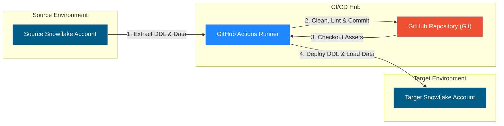
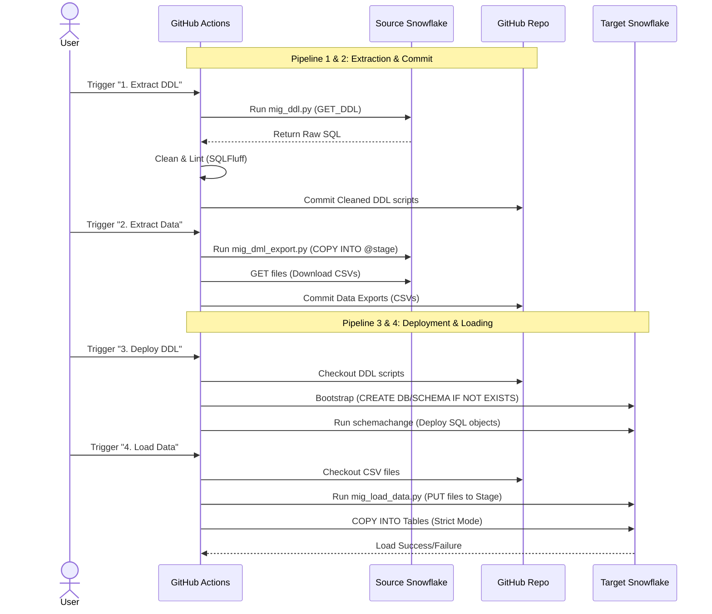

# **❄️  Snowflake Migration Toolkit ❄️**

### ***Automated "Lift-and-Shift" for Agile Data Engineering***

## **1\. What is this Project?**

This is a robust, end-to-end **Continuous Integration/Continuous Deployment (CI/CD)** pipeline built to automate the migration of Snowflake database objects (Tables, Views, Procedures, Functions) and configuration data.

It orchestrates a complete **Extract, Transform, and Load (ETL)** lifecycle for metadata and reference data, moving your entire Snowflake environment from a **Source Account** to a **Target Account** with a single click.

---

## **2\. Why I Created This**

### ***The "Formal" Reason***

In modern data engineering, **Environment Portability** is critical. Teams often struggle to keep Development, QA, and Production environments in sync. Manual migration of DDL scripts and configuration tables is error-prone, tedious, and lacks auditability. This framework introduces rigorous software engineering practices—like linting and automated regression testing—into the database migration lifecycle.

### ***The "Real" Reason (and why you’ll love it)***

Let’s be honest: Snowflake Trial ***Credits run out***.

We’ve all been there. We spend 29 days building a beautiful framework, and on Day 30, the "Trial Expired" notification hits you like a truck.

I built this because I was tired of manually copy-pasting DDL scripts every time I had to spin up a new trial account. This tool allows me to hit a button and "teleport" my entire hard work to a fresh environment in minutes. It turns the "Expiration Date Anxiety" into a simple scheduled task.

---

## **3\. How It Improves Productivity**

* **Zero Manual Scripting:** No more GET\_DDL commands run manually in worksheets. The pipeline handles everything.  
* **Code Hygiene:** It doesn’t just move code; it cleans it. Integrated **SQLFluff** linting ensures that every line of SQL stored in your git repo is formatted to industry standards automatically.  
* **Idempotency:** Run it once or run it 50 times—the pipeline handles CREATE OR REPLACE, IF NOT EXISTS, and data overwrites so your target environment never breaks.  
* **Dependency Freedom:** Smart regex logic strips out environment-specific database names while preserving critical Python imports (like snowpark), making your code truly portable.

---

## **4\. Technical Specifications**

### **Tech Stack**

* **Orchestrator:** GitHub Actions  
* **Language:** Python 3.10  
* **Libraries:** snowflake-connector-python, pandas, schemachange, sqlfluff  
* **Authentication:** Programmatic Access Tokens (PAT) or Key-Pair Auth  
* **Versioning:** Git

### **Architecture Modules**

| Workflow | Function | Key Technical Logic |
| :---- | :---- | :---- |
| **1\. Extract DDL** | Reverse-engineers the Source DB | • Fetches DDL for all objects. • **Sanitizes DDL:** Removes Source\_DB prefixes using regex. • **Lints:** Auto-fixes formatting via SQLFluff. • Commits clean SQL to scripts/ddl. |
| **2\. Extract Data** | Exports static reference data | • **Server-Side Export:** Uses COPY INTO @STAGE for speed. • Downloads compressed .csv.gz files. • Commits to data\_exports/. |
| **3\. Deploy DDL** | Deploys objects to Target | • **Bootstraps:** Auto-creates DB/Schema if missing. • **Schemachange:** Tracks version history of every deployment. • Handles dependency order (Sequences → Tables → Views). |
| **4\. Load Data** | Loads data to Target | • **Strict Mode:** Fails immediately on bad data (ABORT\_STATEMENT). • **Smart Staging:** Moves successful files to a processed/ folder. • Handles NULL variants (like \\N). |

---

### **The High-Level Flow**

This architecture follows a **"GitOps"** model. The Source Database is the "Truth" for the initial state, but once extracted, **GitHub** becomes the Source of Truth for deployment.

1. **Source Extraction:** Python scripts connect to the **Source Snowflake Account**, reverse-engineer the database objects (DDL) and export static data (CSV).  
2. **Repository Storage:** These assets are cleaned, formatted (linted), and committed to your **GitHub Repository**.  
3. **Target Deployment:** GitHub Actions triggers new Python scripts to push these assets to the **Target Snowflake Account**.




---

### **Detailed Code Explanation**

#### **A. Configuration (`config.py`)**

This is the "Brain" of the operation. It centralizes all settings so you don't have to change multiple files when a variable changes.

* **Environment Variables:** Reads secrets and variables (User, Pass, Role, Schema) injected by GitHub Actions.  
* **`DATA_TABLES_TO_EXPORT`:** A critical list that tells the pipeline exactly which tables contain reference data (like `DQ_JOB_EXEC_CONFIG`) that needs to be moved.

#### **B. DDL Extraction (`mig_ddl.py`)**

This script acts as the **Architect**. It reads the Source blueprint and converts it into files.

* **`get_connection()`**: Establishes a secure link to Snowflake using standard password or Key-Pair auth.  
* **`clean_ddl(text)`**:  
  * **The Problem:** Snowflake's `GET_DDL` returns objects with hardcoded paths like `CREATE TABLE PROD_DB.PROD_SCHEMA.MY_TABLE`. If you run this in Dev, it fails because `PROD_DB` doesn't exist.  
  * **The Solution:** This function uses **Regular Expressions (Regex)** to strip *only* the specific Source Database/Schema names configured in `config.py`.  
  * **Smart Safety:** It is designed to ignore standard libraries (like `snowflake.snowpark`), ensuring your Python Stored Procedures don't break.  
* **Sequence/Table/View/Proc Loops:** The script iterates through each object type, fetches the DDL, applies the cleaning logic, and saves it to a structured folder (`scripts/ddl/views`, etc.).  
* **`V1.0.0__initial_ddl.sql`**: It consolidates Sequences and Tables into a single "Baseline" script because these must exist before Views or Procedures can rely on them.

#### **C. Data Export (`mig_dml_export.py`)**

This script is the **Mover**. It handles the heavy lifting of data transfer.

* **Server-Side Export (`COPY INTO @STAGE`):** Instead of pulling rows one by one (which is slow), it commands Snowflake to dump the data into a compressed file inside Snowflake's internal stage. This is extremely fast.  
* **`GET` Command:** It downloads these compressed files (`.csv.gz`) from Snowflake to the GitHub Runner.  
* **`OVERWRITE=TRUE`:** Ensures that if you run the script twice, it replaces the old export instead of creating duplicates.

#### **D. Bootstrap & Deploy (YAML & Schemachange)**

Before deploying code, the environment must exist.

* **Bootstrap Step:** A lightweight Python snippet runs `CREATE DATABASE IF NOT EXISTS`. This prevents the "Object does not exist" error during the first run.  
* **Schemachange:** This tool takes the SQL files generated in step B and runs them in the Target. It maintains a `CHANGE_HISTORY` table to track which files have already been run, ensuring scripts aren't executed twice unnecessarily.

#### **E. Data Load (`mig_load_data.py`)**

This script is the **Builder**. It populates the empty tables in the Target.

* **`PUT` Command:** Uploads the CSVs from the GitHub Runner to the Target Snowflake Stage.  
* **Strict Loading (`ABORT_STATEMENT`):**  
  * The `COPY INTO` command is set to **Fail Immediately** if even one row is bad. This protects your Target environment from corrupt data.  
  * It handles `\N` (from the export) by mapping it to SQL `NULL` using `NULL_IF`.  
* **Smart Staging (Processed/Not Processed):**  
  * Files start in a `not_processed/` folder.  
  * If the load is **Success**, the file is moved to `processed/` (Archive).  
  * If the load **Fails**, the pipeline stops, and the file stays in `not_processed/` for you to inspect.

---

## **5\. User Guide: Operational Manual**

### **5.1. Initial Setup & Prerequisites**

Before running the pipeline, ensure the following are ready:

1. **GitHub Repository:** Clone this repo to your local machine.  
2. **Snowflake Accounts:** You need a **Source** (Prod/UAT) and a **Target** (Dev/Trial) account.  
3. **Service Users:** Create a service user in both accounts with OWNERSHIP or USAGE privileges on the objects you want to migrate.

### **5.2. Step-by-Step Configuration**

#### **Step A: Configure Secrets (Credentials)**

Go to your GitHub Repository → Settings → Secrets and variables → Actions → New Repository Secret.

Add these sensitive values:

* SOURCE\_PASSWORD: The password (or PAT) for your Source Service User.  
* TARGET\_PASSWORD: The password (or PAT) for your Target Service User.

#### **Step B: Configure Environment Variables**

Go to the Variables tab (next to Secrets) → New Repository Variable.

Add these non-sensitive connection details:

* **Source:** SOURCE\_ACCOUNT, SOURCE\_USER, SOURCE\_ROLE, SOURCE\_WAREHOUSE, SOURCE\_DATABASE, SOURCE\_SCHEMA.  
* **Target:** TARGET\_ACCOUNT, TARGET\_USER, TARGET\_ROLE, TARGET\_WAREHOUSE, TARGET\_DATABASE, TARGET\_SCHEMA.

#### **Step C: Define Data Tables in `config.py`**

*This is the most critical step for Data Migration.*

1. Open the file: `scripts/python/config.py` in your code editor.  
2. Locate the list variable named DATA\_TABLES\_TO\_EXPORT.  
3. Add the names of the tables you want to migrate data for.  
   * *Note: Only add reference/static tables (e.g., config tables). Do not add massive transaction tables.*

**Example config.py:**


```
# List of tables to extract data from (Source) and load to (Target)
DATA_TABLES_TO_EXPORT = [
    "DQ_JOB_EXEC_CONFIG",   # <--- Existing table
    "BUSINESS_RULES_REF",   # <--- Newly added table
    "ERROR_CODES"           # <--- Newly added table
]
```

4. Save, Commit, and Push this change to the main branch.

---

### **5.3. Execution Guide (How to Run)**

The pipeline is split into 4 modular workflows. You must run them in this specific order:

| Order | Workflow Name | Action | What it does |
| :---- | :---- | :---- | :---- |
| **1** | **1\. Extract DDL** | Click 'Run Workflow' | Connects to Source, reverse-engineers all DDL, lints the code, and saves it to scripts/ddl. |
| **2** | **2\. Extract Data** | Click 'Run Workflow' | Reads DATA\_TABLES\_TO\_EXPORT from config.py, exports those tables to CSV, and saves them to data\_exports/. |
| **3** | **3\. Deploy DDL** | Click 'Run Workflow' | Pushes the DDL to the Target. **Auto-bootstraps** the database if it doesn't exist. |
| **4** | **4\. Load Data** | Click 'Run Workflow' | Uploads the CSVs to Target and loads them. Moves successful files to a processed stage folder. |



---

### **5.4. Verification**

* **Check DDL:** Login to the Target Snowflake account. Verify that Tables, Views, and Procedures are created in the correct Schema.  
* **Check Data:** Run SELECT \* FROM TargetDB.TargetSchema.DQ\_JOB\_EXEC\_CONFIG to confirm data is loaded.  
* **Check Audit Logs:** Query the CHANGE\_HISTORY table in the Target Schema to see the deployment log.

---

## **6\. Issue Faced (Troubleshooting)**

### **🔴 Error: "Object does not exist" during Deployment**

* **Cause:** The Target Database or Schema was not created before Schemachange ran.  
* **Fix:** The pipeline now includes a **Bootstrap Step** in 3\_deploy\_ddl.yml. Ensure this step is enabled; it auto-executes CREATE DATABASE IF NOT EXISTS.

### **🔴 Error: "Timestamp '\\N' is not recognized"**

* **Cause:** Your source data has NULL values exported as \\N, but Snowflake expects a standard NULL.  
* **Fix:** The loading script (mig\_load\_data.py) includes NULL\_IF=('NULL', 'nan', '\\\\N') in the file format definition.

### **🔴 Error: "ModuleNotFoundError: No module named 'functions'"**

* **Cause:** The DDL cleaning regex was too aggressive and removed the snowflake.snowpark. prefix from your Python imports.  
* **Fix:** The script uses a strict regex that **only** removes the specific Source Database name defined in your variables, leaving standard libraries untouched.

### **🔴 Error: Workflow fails but no error in Python logs**

* **Cause:** Likely a GitHub Actions permission issue.  
* **Fix:** Ensure your YAML files have permissions: contents: write to allow the script to push changes back to the repository.

---


## **7\. Future Roadmap & Enhancements**

As the framework evolves, we plan to implement the following features to improve scalability and user accessibility.

### **7.1. Externalized Configuration for Data Export**

**Current State:** The list of tables to export is hardcoded in `scripts/python/config.py` as a Python list (`DATA_TABLES_TO_EXPORT`). This requires modifying code to change configuration.

**Proposed Enhancement:** Decouple configuration from logic by moving the table list to an external **JSON** or **TXT** file (e.g., `config/tables_to_sync.json`).

* **Benefit:** Business users or analysts can update the list of tables via a simple file upload or Pull Request without touching the Python codebase.  
* **Implementation:** The `mig_dml_export.py` script will be updated to read this external file dynamically at runtime.

### **7.2. Self-Service User Interface (Streamlit App)**

**Current State:** Users must log in to GitHub and manually trigger workflows via the "Actions" tab. This requires GitHub access and familiarity with CI/CD concepts.

**Proposed Enhancement:** Develop a lightweight **Streamlit Application** to serve as a frontend for the migration pipeline.

* **Features:**  
  * **Simple Buttons:** "Migrate DDL", "Sync Data", and "Full Deployment" buttons.  
  * **Status Dashboard:** Real-time visualization of the migration progress and logs.  
  * **Config Manager:** A UI form to add/remove tables from the export list without editing files.  
* **Benefit:** democratizes the migration process, allowing non-technical team members (e.g., QA Leads, Data Stewards) to refresh environments on demand without needing GitHub permissions.

---

Authored by \[Aslam M\]

Connect with me on LinkedIn: \[[Aslam M-LinkedIn](https://www.linkedin.com/in/aslam-m-313057248/)\]

